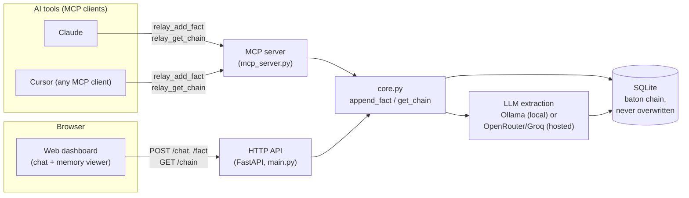

# Relay — Append-Only Layered AI Memory

**Problem.** AI tools forget. Tell Claude something today, it's gone from
context tomorrow, and gone the moment you switch to a different tool
entirely. You end up re-explaining the same decisions over and over.

**Idea.** Relay is a memory backend that saves what you decide as small
facts, and never deletes or overwrites one. When a decision changes, the new
fact links back to the old one instead of replacing it, so the full history
of how your thinking changed stays intact and readable.

**USP.** Every other memory tool overwrites a fact when it's updated. Relay
never does. This isn't a theoretical choice, it's a direct fix to a real bug
in a product I already shipped, see Team below.

**Working MVP.** Not a mockup or a slide. Live backend, live database, a
working web dashboard, and a real MCP server an AI assistant can call
mid-conversation, all linked below.

**Team.** Solo. Built by [Maan Ahir](https://linkedin.com/in/maanahir), who's
been working hands-on with LLMs since 17. Already shipped two AI products
before this one: Torqon (persistent AI memory,
1,800+ downloads in its first week) and Pelladio (multi-model chat,
waitlist live). Relay exists because using Torqon myself surfaced the exact
gap it fixes, overwriting, not append-only, memory.

**Usefulness & impact.** 70% of developers already use 2 or more AI coding
tools at once (JetBrains AI Pulse, 2026), and almost none of those tools
share memory. Anyone switching between Claude, Cursor, or any other
MCP-connected tool stops repeating themselves the moment Relay is in the
loop.

**Scalability.** The underlying pattern already scaled once, Torqon runs the
same core mechanic and hit 1,800+ downloads in week one. SQLite is a
prototype choice, not a ceiling, the append-only schema is already just
linked rows, so it moves to Postgres with no redesign. MCP means any AI tool
can plug in without a custom integration per tool, the surface area doesn't
grow with each new client.

**Architecture.** See the diagram below.

**Phone-first thinking.** The dashboard was built mobile-first from day one,
not adapted after the fact, see "Live link" below for exactly what that
means and why.

**On-device / local models.** Fact extraction runs on Ollama (`llama3.2:1b`)
entirely locally by default, no cloud call required, see "How the public
link is deployed" below for how the same code also runs on a hosted model
when deployed.

**Device performance / Office Kit.** Honest gap: this build does not
currently use vivo's Office Kit APIs, it's a browser-based web app plus an
MCP server. Flagging this directly rather than implying otherwise.

**Supporting links.** This repo, plus the live deployment linked below.

---

Relay is a "baton handoff" memory pattern: instead of an AI agent overwriting
its own state every time something changes, each new fact is appended as a
new row that points back at the fact before it. The full history stays
intact and inspectable — you can always walk the chain backward to see
exactly how the current state was reached.

## How the baton pattern works

1. Every session (`session_id`, shown as a "folder" in the dashboard) has its
   own facts.
2. When new raw input comes in, it's run through the configured LLM, which
   extracts the key decision or state change as one or two sentences.
3. That extracted fact is inserted as a new row, with `parent_fact_id` set to
   the most recent existing fact in that session that it actually shares a
   topic with — like a relay runner handing the baton to the next leg of
   *the same race*, not to a runner in a different race who just happens to
   be standing nearby. A fact about switching databases links back to an
   earlier fact about that database; an unrelated fact about a hosting
   provider gets `parent_fact_id: null` and starts its own thread, instead of
   looking like it grew out of the database decision just because it
   happened to be typed next. Topic matching is deterministic keyword
   overlap (`app/core.py`, `_keywords`/`_STOPWORDS`), not an LLM classifying
   topics: that was tried and rejected, a 1B-class model was unreliable in
   both directions, sometimes drifting to a different label for the same
   topic between runs, sometimes just parroting back whatever topic it was
   shown regardless of fit.
4. Nothing is ever updated or deleted. `get_chain` walks every fact in a
   session oldest → newest (multiple threads interleaved by time, each still
   linked correctly via `parent_fact_id`); `get_latest` just grabs the most
   recent fact overall.

This gives you a full, ordered, attributable audit trail of how an agent's
understanding of each topic evolved, without unrelated decisions getting
tangled into the same chain just because they happened close together in
time.

## Scope of this prototype

This is intentionally minimal: SQLite, no auth, no migrations, no validation
beyond what FastAPI/Pydantic give you for free, one local LLM call per fact.
It exists to prove the mechanic works end-to-end, not to be production-ready.

Built for the iQOO Hackathon 2026. The dashboard, MCP server, and live
deployment below are all real and already working, not planned.

## Live link

```
https://relay-backend-production-019a.up.railway.app
```

Deployed on Railway. Opening that link gives an assistant-style dashboard
(`app/static/index.html`, served at `/`): one ongoing chat, and the saved
memory chain alongside it — on desktop, Memory sits on the *left* at a fixed
20% width (`flex: 0 0 20%`, reordered in front of the chat via CSS `order`,
not DOM order) with Chat filling the remaining 80%.

Built mobile-first, not responsive-as-an-afterthought: the base CSS targets
a phone, one view visible at a time (Chat / Memory) behind a bottom tab bar,
the way a native app works, not panels stacked into one long scroll. Desktop
is a `min-width: 760px` enhancement layered on top that switches to both
panels side by side and hides the tab bar, the same HTML, CSS, and JS serve
both, no separate mobile build. This was deliberate, not a default: the
phone is the primary surface this was designed for, desktop is the addition
layered on top of it, not the other way round.

No folder picker to navigate first: each visitor gets one ongoing session,
assigned automatically and remembered in their browser's `localStorage`
(`relay_session`), not something they create or choose. That's a deliberate
simplification, an earlier version had a folder sidebar modeled on Torqon's
UI, but once the guided category walkthrough (below) lived directly in the
chat, a separate folder-management layer was just friction nobody needed for
a single-visitor demo. The underlying concept is still a `session_id` under
the hood (see `app/core.py`), same as ever, it's just no longer exposed as
something to manage — `?session=name` in the URL still overrides it, mainly
useful for demoing or testing a specific chain directly.

Each category also keeps its own separate memory rather than everything
piling into one chain: picking Database uses the sub-session
`<visitor-session>::Database`, Deployment uses `<visitor-session>::Deployment`,
and so on (see `activeSession()` in `app/static/index.html`). The Memory
panel's heading updates to match, "Database memory," "Deployment memory,"
switching categories reloads it immediately, even before sending anything, so
what's visible always matches what's being explored. Freeform typing with no
category picked falls back to the visitor's plain base session. This also
makes the topic-linking mechanic (see "How the baton pattern works" above)
simpler in practice: since each category's facts are already isolated by
session, cross-category mix-ups (the original bug report that motivated
keyword-overlap linking) are now structurally impossible, not just handled.

The Memory panel also has its own small switcher (General / Database /
Deployment / Dashboard / Just chatting, `#memory-switcher`) so a visitor can
jump straight to any category's memory without going through the chat at
all. It sets the same `activeCategory` the walkthrough uses, so picking one
from the Memory panel also updates which prompts show up back in Chat, one
shared state, not two pickers that could drift out of sync with each other.

Walkthrough progress is tracked per category (`stepByCategory` in
`app/static/index.html`), not as one global step counter. Leave Database on
step 3, switch to Deployment, switch back, Database is still on step 3 — an
earlier version reset to step 1 on every switch (from either the chat's own
category chips or the Memory panel's switcher above), which silently re-sent
step 1 each time a visitor bounced between categories, visible in the chain
as the same fact repeated with new ids.

Just talk normally, the point isn't a form where you manually author
"facts," it's that the assistant decides for itself, mid-conversation, when
something you said is worth remembering, and appends it to your session's
chain without being asked to. Mention a decision and watch it show up under
"Memory" with a `saved to memory` bubble in the chat; say something casual
and nothing gets saved, with a status line saying exactly that.

Suggestions are a guided walkthrough, not a flat list. Land on four big,
centered category cards (Database, Deployment, Dashboard, Just chatting, no
category pre-picked). Pick one and it steps you through 3-4 prompts one at a
time, each click sends that step for real, fades out, and is replaced by the
next ("Step 2 of 4") until a thank-you card closes it out. Prompts within a
category build on each other, e.g. Database's second step ("switch our
database from SQLite to PostgreSQL") is a natural follow-up to its first
("use SQLite for the prototype"), so walking through one category doesn't
just add facts, it visibly demonstrates the topic-linking mechanic: the
second fact's `parent_fact_id` points at the first, provable in the Memory
panel right after clicking. This all lives in `SUGGESTIONS` in
`app/static/index.html`, one object keyed by category, each with a
`forceSave` flag and a `steps` array; both the empty-state and the
composer's always-visible slot render from the same shared functions
(`suggestionsHTML`, `wireSuggestions`, `renderAllSuggestions`).

`forceSave` matters: Database, Deployment, and Dashboard are pre-vetted
decisions, guaranteed saved via `/chat`'s `force_save` (see Endpoints below)
rather than left to the model's live judgment, because a 1B model was
measurably flaky on some of these exact sentences even when clearly
decisions. "Just chatting" is the deliberate exception, its whole point is
proving casual messages don't get saved, so it always goes through the
model's real, honest decision, same as anything a visitor types themselves.
Switching folders (sidebar click, or creating a new one) resets the
walkthrough back to the category picker; the lazy folder auto-created by
clicking a step mid-walkthrough does not, that distinction matters, an
earlier version reset on every folder open and wiped the walkthrough's own
progress the moment its first step tried to save.

Every send shows a status line through the whole round trip: "sending to
Relay, deciding whether to save this..." while the request is in flight,
then either "saved to Relay memory" or "Relay decided there was nothing
worth saving in that message," so it's never ambiguous whether something
got written to memory. Picking or creating a folder jumps straight to the
Chat view, matching how a phone user expects to land in the conversation,
not stare at a folder list.

No account, no setup, works for anyone who has the link. Pass
`?folder=some-name` in the URL to open a specific folder directly.

`/docs` gives the interactive Swagger UI instead, and `/info` gives the
plain JSON service description that used to live at `/`.

## Live demo via MCP (watch an AI assistant write facts in real time)

Curling a URL proves the API works, but it doesn't *show* the mechanic. To
demonstrate the baton handoff the same way a memory server like Torqon
demonstrates itself — as tools an AI assistant calls mid-conversation, with
the results visible right in the chat — Relay is also exposed as an MCP
server: [`mcp_server.py`](mcp_server.py).

It wraps the exact same `app.core.add_fact` / `get_chain` / `get_latest`
functions the HTTP API uses — same SQLite table, same extraction prompt, same
append-only linking. It's a second interface onto identical logic, not a
separate implementation, so anything proven against the HTTP API already
holds here too. Verified end-to-end with a real MCP client over stdio (full
`initialize` → `list_tools` → `call_tool` handshake, not just an import
check) before being wired into `.mcp.json`.

**Tools exposed:**

| Tool | Maps to |
|---|---|
| `relay_add_fact(text, session_id, written_by)` | `core.add_fact` |
| `relay_get_chain(session_id)` | `core.get_chain` |
| `relay_get_latest(session_id)` | `core.get_latest` |

**Activating it**: registered in [`.mcp.json`](../.mcp.json) at the project
root (one level up from `relay-backend/`), pointing at `mcp_server.py` with
`cwd` set to `relay-backend`. MCP servers are loaded when a Claude Code
session starts, so **restart your Claude Code session** for `relay` to show
up as an available tool source. Once it's loaded, defaults to
`LLM_PROVIDER=ollama` (needs `ollama serve` running locally, same as the
local HTTP setup) — this uses the same local `relay.db` the HTTP API uses
when run from this directory, so facts added either way land in the same
chain.

**Demoing it**: after restart, just talk to the assistant —

> "Use the relay tool to remember that we decided to use SQLite for Relay's
> prototype." → assistant calls `relay_add_fact`, you see the extracted fact
> and its `id`/`parent_fact_id` returned right in the conversation.
>
> "Now add another fact: we switched the deployed provider to OpenRouter."
> → calls `relay_add_fact` again, `parent_fact_id` now points at the first
> fact's id.
>
> "Show me the full chain for this session." → calls `relay_get_chain`,
> prints every fact in order.

That's the live, chat-visible version of the same proof `test_relay.py` gives
over HTTP — an actual assistant writing append-only memory, watchable turn by
turn, no separate dashboard needed for this to be demonstrable today.

## Project structure

```
relay-backend/
  app/
    db.py            SQLite schema + connection helper
    llm_client.py    Extracts a fact from raw text — local Ollama or a hosted provider
    core.py          add_fact / get_chain / get_latest
    main.py          FastAPI app wiring the 3 endpoints, serves the demo page at /
    static/
      index.html     Bare form + chain viewer — no framework, no build step
  test_relay.py      Submits sample facts, prints the resulting chain
  mcp_server.py      Same core logic exposed as MCP tools (live chat demo)
  requirements.txt
  Dockerfile         Used for the Railway cloud deploy
  railway.toml       Railway build/deploy config (Dockerfile builder, health check)
  relay.db           created on first run (SQLite file, gitignored)
../.mcp.json          Registers mcp_server.py as a project MCP server
```

Kept as a thin `app/` package specifically so a future dashboard (or any other
client) can either import `app.core` directly, or hit the HTTP API — nothing
in `core.py` depends on FastAPI.

## Running locally (Ollama)

```bash
cd relay-backend
pip install -r requirements.txt
```

You also need [Ollama](https://ollama.com) running locally with the model pulled:

```bash
ollama pull llama3.2:1b
ollama serve
```

Then:

```bash
uvicorn app.main:app --reload
```

Runs at `http://localhost:8000`. The `facts` table is created automatically
on startup if it doesn't exist.

## How the public link is deployed

A cloud host can't reach `localhost:11434` on a laptop, so the deployed
instance swaps the fact-extraction call from local Ollama to
[OpenRouter](https://openrouter.ai) (hosted models, paid key with credits).
This is controlled by one env var — `app/llm_client.py` picks the provider
based on `LLM_PROVIDER`, so `app/core.py` and everything above it doesn't
change either way.

| | Local (default) | Deployed |
|---|---|---|
| `LLM_PROVIDER` | `ollama` (default, no need to set it) | `openrouter` |
| Model | `llama3.2:1b` via `localhost:11434` | `meta-llama/llama-3.2-1b-instruct` via OpenRouter (~$0.000007/fact) |
| Storage | `relay.db` next to the code | `relay.db` on a Railway volume mounted at `/data` (`RELAY_DB_PATH`) |
| Needs | Ollama running locally | `OPENROUTER_API_KEY` |

`llm_client.py` also still supports `LLM_PROVIDER=groq` if you'd rather use a
free Groq key instead of a paid OpenRouter one — same pattern, different env
vars (`GROQ_API_KEY`, `GROQ_MODEL`).

Deployed via the Railway CLI directly from this directory — no GitHub repo
needed:

```bash
railway login          # opens a browser once
railway init --name relay-backend
railway variable set LLM_PROVIDER=openrouter
railway variable set OPENROUTER_MODEL=meta-llama/llama-3.2-1b-instruct
railway variable set RELAY_DB_PATH=/data/relay.db
echo "<your-openrouter-key>" | railway variable set OPENROUTER_API_KEY --stdin
railway volume add --mount-path /data
railway up -c
railway domain --port 8080   # Railway assigns its own $PORT; match it here
```

Note the last step: Railway injects its own `$PORT` into the container (the
`Dockerfile`'s `CMD` already binds uvicorn to it), and the public domain has
to be pointed at that same port explicitly, or you'll get a 502 from the edge
proxy even though the app itself is healthy — check `railway logs` for the
"Uvicorn running on ..." line to see which port it actually picked.

**Redeploying after a code change**: `railway up -c` from this directory.

**Persistence**: unlike a typical free-tier host, the Railway volume at
`/data` genuinely survives restarts and redeploys — `relay.db` isn't wiped on
inactivity the way it would be on most free container platforms. This took a
real bug to get right: setting `RELAY_DB_PATH` through the Railway CLI from
Git Bash silently mangled `/data/relay.db` into a Windows-style path
(`C:/Program Files/Git/data/relay.db`), so the app was writing to an
ephemeral path inside the container instead of the mounted volume, and every
redeploy quietly lost all data. Fixed by setting the variable with
`MSYS_NO_PATHCONV=1` (same fix the volume's `--mount-path` needed earlier)
and verified by writing a fact, forcing a redeploy, and confirming it was
still there afterward.

## Endpoints

The three required by the original spec, plus `/chat` (the demo path),
`/folders` (for the dashboard sidebar), and `/` (the dashboard itself).
Everything except `/` returns JSON.

| Method | Path | Body / Params | Description |
|---|---|---|---|
| `POST` | `/fact` | `{ "text": str, "session_id": str, "written_by": str }` | Caller explicitly hands over text; extracts a fact from it via the configured model, links it to the session's current latest fact, saves it |
| `GET` | `/chain/{session_id}` | — | Full baton chain for the session, oldest → newest |
| `GET` | `/latest/{session_id}` | — | Just the most recent fact for the session (404 if none) |
| `POST` | `/chat` | `{ "message": str, "session_id": str, "force_save": bool }` | The demo path: reply to `message` naturally, and separately let the model decide whether it describes a decision worth saving — the model decides, the caller doesn't. An explicit ask ("save that...", "remember that...") is always honored directly rather than left to the model's judgment. `force_save` (default `false`) skips the model's judgment entirely and always saves — used only by the dashboard's curated suggestion buttons (pre-vetted example decisions, not live typing), never for freeform messages; see "Suggestions" below for why. Returns `{ "reply": str, "saved_fact": dict \| null }` |
| `GET` | `/folders` | — | Every session, most recently active first, with a fact count each. No longer surfaced in the UI (see "No folder picker" above) but still useful for inspecting what sessions exist, e.g. while testing |
| `DELETE` | `/reset` | — | Wipes every fact in every folder, no undo. Not linked from the UI. For clearing dev/test data between demo runs: `curl -X DELETE <url>/reset` |
| `GET` | `/` | — | The chat demo page (`app/static/index.html`) |

### `facts` table schema

| column | type | notes |
|---|---|---|
| `id` | INTEGER | autoincrement primary key |
| `content` | TEXT | the extracted fact |
| `written_by` | TEXT | model/agent name that produced it |
| `timestamp` | DATETIME | defaults to insert time |
| `parent_fact_id` | INTEGER, nullable | id of the previous fact in this session's chain |
| `session_id` | TEXT | groups facts into chains |

## Proving it works

Locally, with the API and Ollama both running:

```bash
python test_relay.py
```

This submits 3–4 sample inputs (each simulating a decision or state change)
to the same session, then fetches `/chain/{session_id}` and prints every fact
in order along with its `parent_fact_id`, showing the append-only links
holding together end to end.

To run the same proof against the live deployment instead, change `BASE_URL`
at the top of `test_relay.py` to
`https://relay-backend-production-019a.up.railway.app` and run it again — no
local Ollama needed since the deployed instance uses OpenRouter. This was
already run once against the live link with session id `live-demo-001`; hit
`/chain/live-demo-001` on the URL above to see that exact result.

`test_relay.py` proves the mechanic via `POST /fact` (caller supplies the
text). To prove the actual demo path — the model deciding on its own —
hit `/chat` instead:

```bash
curl -X POST https://relay-backend-production-019a.up.railway.app/chat \
  -H "Content-Type: application/json" \
  -d '{"message": "lets use SQLite instead of Postgres for the prototype", "session_id": "curl-test"}'
```

The response's `saved_fact` will be non-null for a decision like that one,
and `null` for something like `{"message": "hey how are you"}` — same
behavior visible on the chat page.

## Architecture



Both entry points, the MCP server an AI tool calls, and the HTTP API the
dashboard calls, run through the exact same `core.py` functions and write to
the same database. Nothing about the memory logic changes depending on which
one is used.

Every write goes through one shared step: raw text into the configured LLM
(local Ollama by default, a hosted model when deployed), which returns a
short extracted fact. That fact is inserted as a new row, linked to the
existing fact it updates rather than replacing it.
