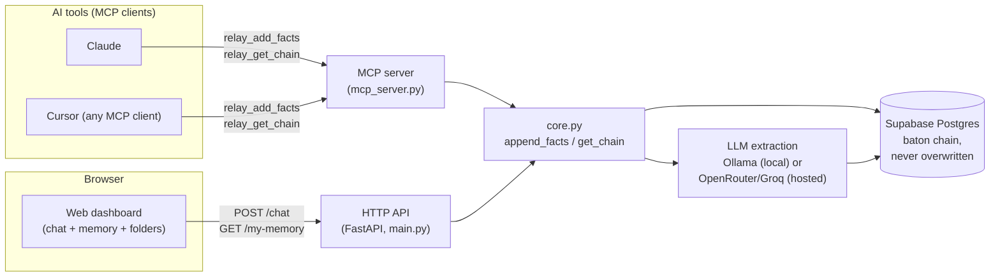

# Relay — Append-Only Layered AI Memory

**Problem.** AI tools forget. Tell Claude something today, it's gone from
context tomorrow, and gone the moment you switch to a different tool
entirely. You end up re-explaining the same decisions over and over.

**Idea.** Relay is a memory backend that saves what you decide as small,
atomic facts, and never deletes or overwrites one. When a decision changes,
the new fact links back to the old one instead of replacing it, so the full
history of how your thinking changed stays intact and readable.

**USP.** Every other memory tool overwrites a fact when it's updated. Relay
never does. This isn't a theoretical choice, it's a direct fix to a real bug
in a product I already shipped, see Team below.

**Working MVP.** Not a mockup or a slide. Live backend, live Postgres
database, a working web dashboard, and a real MCP server an AI assistant can
call mid-conversation, all linked below.

**Team.** Solo. Built by [Maan Ahir](https://linkedin.com/in/maanahir), who's
been working hands-on with LLMs since 17. Already shipped two AI products
before this one: Torqon (persistent AI memory, 1,800+ downloads in its first
week) and Pelladio (multi-model chat, waitlist live). Relay exists because
using Torqon myself surfaced the exact gap it fixes, overwriting, not
append-only, memory.

**Usefulness & impact.** 70% of developers already use 2 or more AI coding
tools at once (JetBrains AI Pulse, 2026), and almost none of those tools
share memory. Anyone switching between Claude, Cursor, or any other
MCP-connected tool stops repeating themselves the moment Relay is in the
loop.

**Scalability.** The underlying pattern already scaled once, Torqon runs the
same core mechanic and hit 1,800+ downloads in week one. Relay itself now
runs on Supabase Postgres (not SQLite, that was the earlier prototype), so
scaling the database is already someone else's problem, not a redesign.
MCP means any AI tool can plug in without a custom integration per tool, the
surface area doesn't grow with each new client.

**Architecture.** See the diagram near the bottom.

**Phone-first thinking.** The dashboard was built mobile-first from day one,
not adapted after the fact, see "Live link" below for what that means.

**On-device / local models.** Fact extraction runs on Ollama (`llama3.2:1b`)
entirely locally when developing, no cloud call required. The deployed
instance uses a hosted model instead (see "How the public link is deployed"),
since Vercel's serverless functions can't reach a laptop's `localhost:11434`.

**Device performance / Office Kit.** Honest gap: this build does not
currently use vivo's Office Kit APIs, it's a browser-based web app plus an
MCP server. Flagging this directly rather than implying otherwise.

**Supporting links.** This repo, plus the live deployment linked below.

---

Relay is a "baton handoff" memory pattern: instead of an AI agent overwriting
its own state every time something changes, each new fact is appended as a
new row that points back at the fact before it. The full history stays
intact and inspectable — you can always walk the chain backward to see
exactly how the current state was reached.

## How the baton pattern works

1. Every session (`session_id`) has its own facts. On the dashboard a session
   is an IP address plus a folder name the visitor picks (see "Live link"
   below) — the MCP server and the raw HTTP API use whatever `session_id`
   the caller passes directly instead.
2. When new raw input comes in, it's run through the configured LLM, which
   breaks it into **atomic facts** — small, self-contained details, not one
   summary sentence. "I'm building a Pomodoro timer called Hello, it can
   pause and skip sessions" becomes four separate facts: a name, a type, and
   two features, each with its own `category` label. This matters for the
   next step: an atomic fact can be updated on its own later without
   dragging unrelated facts along with it.
3. Each atomic fact is inserted as a new row, with `parent_fact_id` set to
   the most recent existing fact **in the same category** that it actually
   shares a keyword with — like a relay runner handing the baton to the next
   leg of *the same race*, not to a runner in a different race who just
   happens to be standing nearby. A later fact about switching databases
   links back to an earlier fact about that same database; an unrelated
   fact about a hosting provider gets `parent_fact_id: null` and starts its
   own thread. Topic matching is deterministic keyword overlap
   (`app/core.py`, `_keywords`/`_STOPWORDS`), not an LLM classifying topics:
   that was tried and rejected, a small model was unreliable in both
   directions, sometimes drifting to a different label for the same topic
   between runs, sometimes just parroting back whatever topic it was shown
   regardless of fit.
4. Nothing is ever updated or deleted. `get_chain` walks every fact in a
   session oldest → newest (multiple threads interleaved by time, each still
   linked correctly via `parent_fact_id`); `get_latest` grabs the most recent
   fact overall.

This gives a full, ordered, attributable audit trail of how an agent's
understanding of each topic evolved, without unrelated decisions getting
tangled into the same chain just because they happened close together in
time.

## Scope of this prototype

No auth, no migrations, no validation beyond what FastAPI/Pydantic give you
for free, one LLM call per message (plus a retry only if the first attempt
came back empty, see "Extraction reliability" below). It exists to prove the
mechanic works end-to-end, not to be a finished product.

Built for the iQOO Hackathon 2026. The dashboard, MCP server, and live
deployment below are all real and already working, not planned.

## Live link

```
https://relay-iqoo.vercel.app
```

Deployed on Vercel, backed by Supabase Postgres. Opening that link gives an
assistant-style dashboard (`app/static/index.html`, served at `/`): one
ongoing chat, and the saved memory chain alongside it — on desktop, Memory
sits on the *left* at a fixed 22% width (`flex: 0 0 22%`, reordered in front
of the chat via CSS `order`, not DOM order) with Chat filling the remaining
78%.

Built mobile-first, not responsive-as-an-afterthought: the base CSS targets
a phone, one view visible at a time (Chat / Memory) behind a bottom tab bar,
the way a native app works, not panels stacked into one long scroll. Desktop
is a `min-width: 760px` enhancement layered on top that switches to both
panels side by side and hides the tab bar, the same HTML, CSS, and JS serve
both, no separate mobile build. This was deliberate, not a default: the
phone is the primary surface this was designed for, desktop is the addition
layered on top of it, not the other way round.

**Identity is the visitor's IP address**, not a random id generated in the
browser. An earlier version used `localStorage`, which meant a page refresh
or a different browser lost the session; a visitor's memory now survives
both, as long as they're on the same network. This is server-side
(`client_ip()` in `app/main.py`, reading `X-Forwarded-For` since Vercel sits
in front of the app) — the browser never sees or handles the raw IP itself.

**Folders** are a namespace under that IP, picked in the UI, not a fixed
category list. The folder switcher lives in the Memory tab (`+ Folder` to
create one, tap a pill to switch); the chat header just shows which folder
you're currently in as plain text, it doesn't duplicate the switcher. Every
folder keeps completely separate memory — switching folders changes both
what gets saved and what's shown, and the chat view resets to empty (the
memory itself is untouched, only which folder's conversation is on screen
changes). `?folder=name` in the URL jumps straight to one.

**First-visit onboarding**: a short 3-step overlay (shown once, tracked via
`localStorage`'s `relay_onboarded`) explains the two things people got
confused by without it — that saying "save this" directly is the reliable
way to get something saved, and that saved facts live in a folder separate
from the chat itself.

Just talk normally — the point isn't a form where you manually author
"facts." Nothing is saved unless you explicitly ask: say "save this" or
"remember that" and it's saved, guaranteed (`EXPLICIT_SAVE_TRIGGERS` in
`app/llm_client.py`). Auto-detecting "worth remembering" from freeform chat
was tried and cut — even after every reliability fix below, it still
produced real false positives (a plain "hello, who are you?" once got saved
as a fact named "Relay"), and that failure mode is invisible until you
notice something wrong in Memory later. Asking directly is the deterministic
fix, same reasoning as `EXPLICIT_SAVE_TRIGGERS` itself, just applied to the
whole feature. A save shows up in the chat itself ("I saved this to Relay."),
styled the same as the assistant's own reply, not a separate colored
notification, plus a status line ("saved N facts to Relay memory").

No account, no setup, works for anyone who has the link.

`/docs` gives the interactive Swagger UI, `/info` gives a plain JSON service
description.

### Extraction reliability

Getting a small model to reliably decide "is there anything worth saving
here" turned out to be the hardest part of this build — hard enough that,
as above, the dashboard no longer asks a model to make that call at all,
saving only happens on an explicit ask now. `extract_facts()` still uses
these layers below once that ask happens, though, since even "the user
already said save this, now break it into atomic facts" turned out to have
real failure modes worth guarding against deterministically:

- **A separate yes/no gate before extraction was tried and cut.** It failed
  at roughly the same ~40% rate the extraction call itself did on its own,
  even at `temperature=0` — that's inference-level non-determinism from the
  hosted provider, not a prompt-wording problem. It was pure extra latency
  and cost with no reliability benefit.
- **`extract_facts()` retries once if the first attempt comes back empty**,
  which cuts a false "nothing here" down to roughly 15-20% instead of
  accepting what's often just a coin-flip as the real answer.
- **The retry is skipped for a plain question** ("what's the market size of
  X?"). A question correctly comes back empty most of the time on its own,
  but a retry occasionally hallucinated a fake fact like "the market size is
  unknown" out of nothing — the exact "invented answer to a question"
  failure the prompt already warns against, just reintroduced by giving it a
  second roll of the dice.
- **Two more layers of that same failure are blocked deterministically, not
  just asked against in the prompt**: a bare non-answer as a fact's entire
  content (`_NON_ANSWERS`: "unknown", "n/a", "unclear", etc.), and the model
  leaking its own reasoning about why a non-answer counts
  (`_REASONING_LEAK_PHRASES`, e.g. any content containing "is unknown" or
  "the only fact"). A prompt instruction reduces how often a fabricated fact
  slips through; it doesn't guarantee it never does, so the code doesn't
  trust it alone.
- Also blocked outright: a fact that just echoes the raw input back
  verbatim, and a fact whose `category` is really the model describing its
  own input rather than a real detail (`_META_CATEGORIES`).

Verified directly against the live deployment, repeatedly, not assumed:
5/5 on real content saving, 5/5 on casual chat staying empty, 9/10 on the
exact question that used to fabricate a fact roughly half the time.

## Live demo via MCP (watch an AI assistant write facts in real time)

Curling a URL proves the API works, but it doesn't *show* the mechanic. To
demonstrate the baton handoff the same way a memory server like Torqon
demonstrates itself — as tools an AI assistant calls mid-conversation, with
the results visible right in the chat — Relay is also exposed as an MCP
server: [`mcp_server.py`](mcp_server.py).

It wraps the exact same `app.core.add_facts` / `get_chain` / `get_latest`
functions the HTTP API uses — same Postgres table, same extraction, same
append-only linking. It's a second interface onto identical logic, not a
separate implementation. The MCP path uses whatever `session_id` the caller
passes directly (unlike the dashboard, it isn't scoped by IP + folder).

**Tools exposed:**

| Tool | Maps to |
|---|---|
| `relay_add_facts(text, session_id, written_by)` | `core.add_facts` — returns a list, possibly more than one fact, possibly empty |
| `relay_get_chain(session_id)` | `core.get_chain` |
| `relay_get_latest(session_id)` | `core.get_latest` |

**Activating it**: registered in [`.mcp.json`](../.mcp.json) at the project
root (one level up from `relay-backend/`), pointing at `mcp_server.py` with
`cwd` set to `relay-backend`. MCP servers are loaded when a Claude Code
session starts, so **restart your Claude Code session** for `relay` to show
up as an available tool source. It needs `DATABASE_URL` set in its
environment (same Supabase database as everything else, see "Running
locally" below), and defaults to `LLM_PROVIDER=ollama` for extraction.

**Demoing it**: after restart, just talk to the assistant —

> "Use the relay tool to remember that we decided to use Postgres for
> Relay's database." → assistant calls `relay_add_facts`, you see the
> extracted fact(s) and their `id`/`parent_fact_id` returned right in the
> conversation.
>
> "Now add another fact: we switched the deployed provider to Vercel."
> → calls `relay_add_facts` again, `parent_fact_id` now points at the
> related earlier fact's id, not just whatever came before it in time.
>
> "Show me the full chain for this session." → calls `relay_get_chain`,
> prints every fact in order.

## Project structure

```
relay-backend/
  app/
    db.py            Postgres (Supabase) connection + schema
    llm_client.py    Extraction — local Ollama or a hosted provider, atomic facts, reliability layers
    core.py          append_facts / add_facts / get_chain / get_latest / list_folders / reset_all
    main.py          FastAPI app: /chat, /fact, /my-folders, /my-memory, /chain, /latest, /folders, /reset
    static/
      index.html     The dashboard — chat, memory panel, folder switcher, onboarding. No framework, no build step.
  api/
    index.py         Vercel entrypoint, re-exports the FastAPI app
  test_relay.py      Submits sample facts via POST /fact, prints the resulting chain
  mcp_server.py      Same core logic exposed as MCP tools (live chat demo)
  requirements.txt
  vercel.json        Vercel Python builder config
  Dockerfile         Legacy — was used for an earlier Railway deploy, unused now
  railway.toml       Legacy — same
```

Kept as a thin `app/` package specifically so any client can either import
`app.core` directly, or hit the HTTP API — nothing in `core.py` depends on
FastAPI.

## Running locally

```bash
cd relay-backend
pip install -r requirements.txt
```

Needs a Postgres database (Supabase or otherwise) — this moved off SQLite,
so local dev and the deployed instance now share the same kind of database
instead of two different storage paths. Set `DATABASE_URL` to its connection
string:

```bash
export DATABASE_URL="postgresql://..."
```

And for extraction, either point at a local Ollama:

```bash
ollama pull llama3.2:1b
ollama serve
```

or set `LLM_PROVIDER=openrouter` (or `groq`) plus that provider's API key,
same as the deployed instance.

Then:

```bash
uvicorn app.main:app --reload
```

Runs at `http://localhost:8000`. The `facts` table is created automatically
on startup if it doesn't exist (`init_db()`, idempotent — safe to run
against an already-migrated database too).

## How the public link is deployed

Vercel (serverless FastAPI via `api/index.py` + `vercel.json`) plus Supabase
Postgres for storage. A cloud host can't reach `localhost:11434` on a
laptop, so the deployed instance uses a hosted model for extraction instead
of local Ollama — controlled by one env var, `app/llm_client.py` picks the
provider based on `LLM_PROVIDER`, so `app/core.py` and everything above it
doesn't change either way.

| | Local (default) | Deployed |
|---|---|---|
| `LLM_PROVIDER` | `ollama` (default, no need to set it) | `openrouter` |
| Model | `llama3.2:1b` via `localhost:11434` | `meta-llama/llama-3.1-8b-instruct` via OpenRouter |
| Storage | Postgres via `DATABASE_URL` (any host) | Supabase Postgres via `DATABASE_URL` |
| Needs | Ollama running locally, or a hosted provider key | `DATABASE_URL`, `OPENROUTER_API_KEY` |

`llm_client.py` also still supports `LLM_PROVIDER=groq` if you'd rather use a
free Groq key instead of a paid OpenRouter one — same pattern, different env
vars (`GROQ_API_KEY`, `GROQ_MODEL`).

Deployed via the Vercel CLI from this directory:

```bash
vercel link                         # once, links this directory to the Vercel project
vercel env add DATABASE_URL production       # Supabase connection string (pooled, port 6543)
vercel env add LLM_PROVIDER production       # "openrouter"
vercel env add OPENROUTER_API_KEY production
vercel --prod
```

**Redeploying after a code change**: `vercel --prod --yes` from this
directory.

**Model upgrade note**: extraction started on `meta-llama/llama-3.2-1b-instruct`,
the same model used everywhere else in this project, but it measurably
dropped real details from multi-part messages (a project's own name
disappearing from what got saved). Bumped to `meta-llama/llama-3.1-8b-instruct`
for extraction specifically — still fractions of a cent per call — which
fixed it. See "Extraction reliability" above for the other reliability work
this went through.

**A Railway deployment existed earlier in this project** (SQLite on a
mounted volume) and has since gone offline on its own; Vercel + Supabase is
the current and only live deployment. `Dockerfile` and `railway.toml` are
left in the repo as a record of that, not something to redeploy.

## Endpoints

| Method | Path | Body / Params | Description |
|---|---|---|---|
| `POST` | `/chat` | `{ "message": str, "folder": str }` | The dashboard's path: reply to `message` naturally, and separately extract whatever atomic facts (if any) it contains. Session is the caller's IP + `folder`, not something the client can spoof. Returns `{ "reply": str, "saved_facts": list[dict], "folder": str }` |
| `GET` | `/my-folders` | — | This visitor's own folders (by IP), most recently active first |
| `GET` | `/my-memory/{folder}` | — | This visitor's chain for one of their own folders |
| `POST` | `/fact` | `{ "text": str, "session_id": str, "written_by": str }` | Caller explicitly hands over text and a raw `session_id` (used by the MCP server and direct testing, not IP-scoped); extracts whatever atomic facts it contains and appends them all. Returns a list, possibly empty |
| `GET` | `/chain/{session_id}` | — | Full baton chain for a raw session_id, oldest → newest |
| `GET` | `/latest/{session_id}` | — | Just the most recent fact for a raw session_id (404 if none) |
| `GET` | `/folders` | — | Every folder across every visitor. Not used by the dashboard (see `/my-folders`); kept for direct inspection |
| `DELETE` | `/reset` | — | Wipes every fact in every folder, no undo. Not linked from the UI. For clearing dev/test data between demo runs: `curl -X DELETE <url>/reset` |
| `GET` | `/` | — | The dashboard (`app/static/index.html`) |

### `facts` table schema

| column | type | notes |
|---|---|---|
| `id` | SERIAL | primary key |
| `content` | TEXT | the extracted, atomic fact |
| `category` | TEXT | short label the model chose ("name", "feature", "decision", ...), default `"general"` |
| `written_by` | TEXT | model/agent name that produced it |
| `timestamp` | TIMESTAMPTZ | defaults to insert time |
| `parent_fact_id` | INTEGER, nullable | id of the earlier fact (same category, shared keyword) this one updates |
| `session_id` | TEXT | groups facts into chains — an IP+folder on the dashboard, or whatever the caller passed via `/fact` / MCP |

## Proving it works

Locally, with the API and Ollama both running:

```bash
python test_relay.py
```

Submits a handful of sample inputs to `POST /fact`, then fetches the
resulting chain and prints every fact with its `id`, `parent_fact_id`, and
`category`, showing the append-only links holding together end to end. Each
input can produce more than one atomic fact — `test_relay.py` prints all of
them, not just one per input.

To prove the actual dashboard path — the model deciding on its own what's
worth saving — hit `/chat` directly:

```bash
curl -X POST https://relay-iqoo.vercel.app/chat \
  -H "Content-Type: application/json" \
  -d '{"message": "we decided to use Supabase Postgres instead of SQLite", "folder": "curl-test"}'
```

`saved_facts` will be a non-empty list for a real decision like that one, and
an empty list for something like `{"message": "hey how are you"}` — same
behavior visible on the chat page.

## Architecture



Both entry points, the MCP server an AI tool calls, and the HTTP API the
dashboard calls, run through the exact same `core.py` functions and write to
the same database. Nothing about the memory logic changes depending on which
one is used.

Every write goes through one shared step: raw text into the configured LLM
(local Ollama by default, a hosted model when deployed), which returns one
or more short, atomic facts. Each is inserted as a new row, linked to the
existing fact it updates rather than replacing it.
